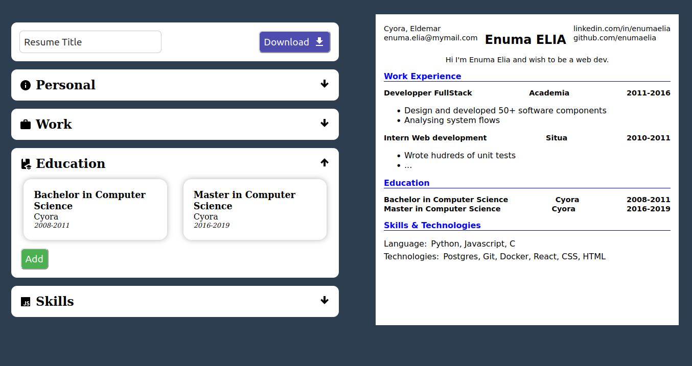

# CV Application

> Libraries
> - **[React](https://react.dev)**
> - **[jspdf](http://raw.githack.com/MrRio/jsPDF/master/docs/index.html)**
> - **[html2canvas](https://html2canvas.hertzen.com/)**
> - **[Vite](https://vitejs.dev)**

## Description
Small application to apply what I've learned the React's library especially states.

It is a project allowing the building of a resume quickly with intuitive tools.

## Preview

[Come see the live site deployed on netlify](https://main--cv-creation-app.netlify.app/)

